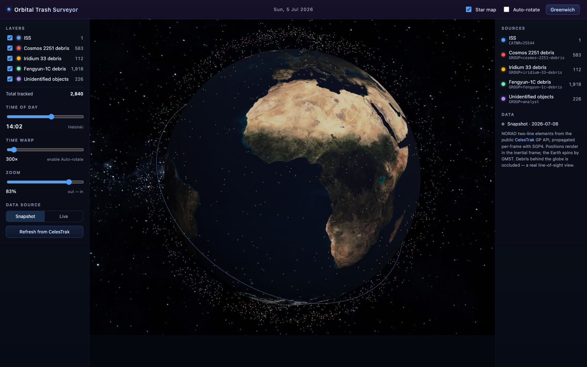

# Orbital Trash Surveyor

A browser 3D visualization of Earth with the **ISS** and real **orbital-debris fields**, rendered at
their true orbits and propagated per-frame from NORAD **TLE** data (CelesTrak). Proof of concept.



## What it shows

- A textured, GMST-spun Earth on a star field, framed on the **Greenwich meridian**.
- Real **day/night lighting** — the Sun is positioned from the simulation time, so the terminator
  falls across the globe and moves as you scrub the time of day.
- The **ISS** as a marker with a live orbit trail.
- Four debris clouds — **Cosmos 2251**, **Iridium 33**, **Fengyun-1C**, and **unidentified
  (analyst) objects** — each a single `THREE.Points` cloud at its real orbital shell.
- Debris behind the globe is **occluded** (depth-tested), so it reads as a true line-of-sight view.

## Controls

- **Layers** — toggle each field; live object counts and a running total.
- **Time of day** — scrub the whole simulation across a day; defaults to the current **Finnish
  (Helsinki)** time.
- **Time warp** — speed factor used while Auto-rotate is on.
- **Auto-rotate** (header) — advance the sim clock so orbits propagate and the Earth spins by GMST.
- **Greenwich** (header) — re-frame the camera on the prime meridian.
- **Star map** (header) — toggle the Milky Way background on/off.
- **Data source** — switch **Snapshot ⇄ Live** and **Refresh from CelesTrak**; live failures fall
  back to the bundled snapshot with a non-blocking notice.

## Run

```bash
npm install
npm run dev      # open the served URL (default http://localhost:5173)
npm run build    # production build → dist/
```

### Start / stop with Claude Code

This project ships slash commands in `.claude/commands/`, so from a Claude Code session opened in
this directory you can run:

- **`/start`** — installs dependencies if needed, launches the Vite dev server on the fixed port
  **5173** (`--strictPort`), waits until it is listening, and prints the accessible URL
  (**http://localhost:5173/**).
- **`/stop`** — stops that dev server and frees port 5173.

## Adding a debris field (no code changes)

The visualization is **data-driven** via `data/catalog.json`. To add a field:

1. Drop a 3-line `<name>.tle` snapshot into `data/` (e.g. from the CelesTrak GP API).
2. Append one entry to `data/catalog.json`:

   ```json
   {
     "id": "my-field",
     "label": "My debris field",
     "file": "my-field.tle",
     "liveUrl": "https://celestrak.org/NORAD/elements/gp.php?GROUP=...&FORMAT=tle",
     "render": "points",
     "color": "#f0a",
     "size": 1.6,
     "enabled": true
   }
   ```

The reactive `fields[]` then renders a new scene layer **and** its toggle + legend row
automatically — no component edits. (`render: "marker"` gives the ISS-style marker + trail.)

## How it works

- **Vite + Vue 3** (`<script setup>` SFCs) with **[TresJS](https://tresjs.org)** — a declarative
  Vue renderer for Three.js. The scene *shell* (canvas, camera, `OrbitControls`, lights, Earth mesh,
  star field) is declarative; each debris field is an imperative `THREE.Points` mounted via
  `<primitive>` for one draw call over thousands of fragments.
- **[satellite.js](https://github.com/shashwatak/satellite-js)** runs SGP4 on each TLE per frame to
  get ECI/TEME positions, plus `gstime` for Earth rotation.
- Per-frame work (SGP4 positions, Earth spin) mutates preallocated `Float32Array`s / object
  transforms directly inside the render loop — never through reactive props. Reactive Vue state is
  used only for UI (toggles, sliders, counts, data mode). Propagation is throttled to ~20 Hz and
  skipped entirely while the clock is paused.
- Scene scale is `1 unit = 1000 km`; SGP4's Z-up TEME frame is mapped to Three's Y-up axes (north
  pole = +Y). We treat TEME as ECI for this visual POC — see `data/README.md` and the plan for the
  accuracy note.

## Data

Snapshots in `data/` are NORAD TLEs from the public, no-auth **CelesTrak** GP API, captured
**2026-07-06**. See [`data/README.md`](data/README.md) for per-field provenance and object counts.
No secrets or credentials are involved.

## Project layout

```
data/            catalog.json + *.tle snapshots (the extensibility contract)
public/textures/ earth.jpg (NASA Blue Marble; procedural fallback in code)
src/
  components/    GlobeScene, Earth, DebrisField, AppHeader, ControlPanel, Legend
  composables/   useCatalog, useOrbitData, useSimClock, useGlobeView, useGlobeHover, useBackground
  lib/           tle (parse), propagate (SGP4→scene), frames (scale/axes), sun (solar position)
```
